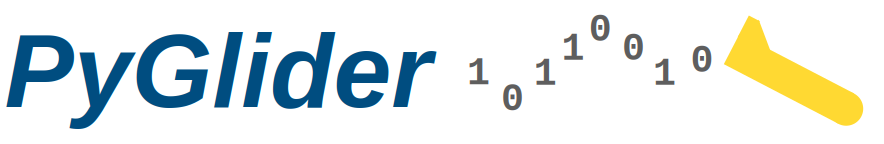

# THIS REPOSITORY IS IN DEVELOPMENT. USE WITH CAUTION!

Python tools for interacting with ocean glider data. PyGlider takes data from
Teledyne/Webb Slocum gliders and Alseamar SeaExplorers and creates CF-compliant
NetCDF files.

For documentation, please see <http://pyglider.readthedocs.io>

### Contact

Get in touch with us using Discussion in the original repo or by opening an issue.
